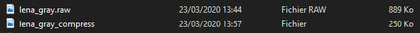

# Traitement Numérique de l'Information

## Projet 3

****

###### Louise Robert - Alex Broussard - Damien Carrier

#### 0. Introduction

#### 1. Combien de *paquets* contient chaque ligne ?

Nous sommes contrains de faire des *paquets* de 8 pixels.

On sait aussi qu'il y a 512 pixels par ligne, donc : 

$$
\frac{512}{8} = 64
$$

Il y a donc 64 paquets par ligne.

#### 2. Avec le modèle de probabilité de l'image, *taguez* chaque paquet en construisant un codeur arithmétique

En reprenant le fichier raw construit lors du projet un, nous allons construire le TAG pour les 32768 paquets.

$$
512*64 = 32768
$$

#### 3. Utiliser un code binaire pour chaque tag et calculer le nombre total d'octets de cette représentation

il y a 32 768 tags flottants dans notre image, un flottant faisant 8 octets, notre image binaire pèse donc 8 * 32768 = 262 144 octets. 
#### 4. Comparez la taille du fichier binaire ainsi obtenu à la taille du fichier original

Notre fichier initial fait 889Ko et le fichier final compressé fait 250Ko, on a donc bien réalisé une compression à l'aide de l'algorithme.

#### 5. Estimer le taux de compression de votre codeur pour cette image

$$
1 - \frac{889}{250} = 0,719
$$

Nous avons donc un taux de compression de 71,9%.
